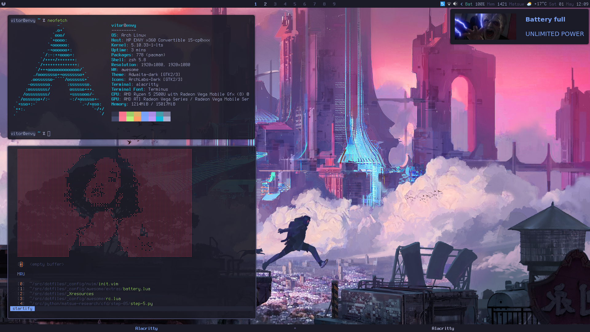
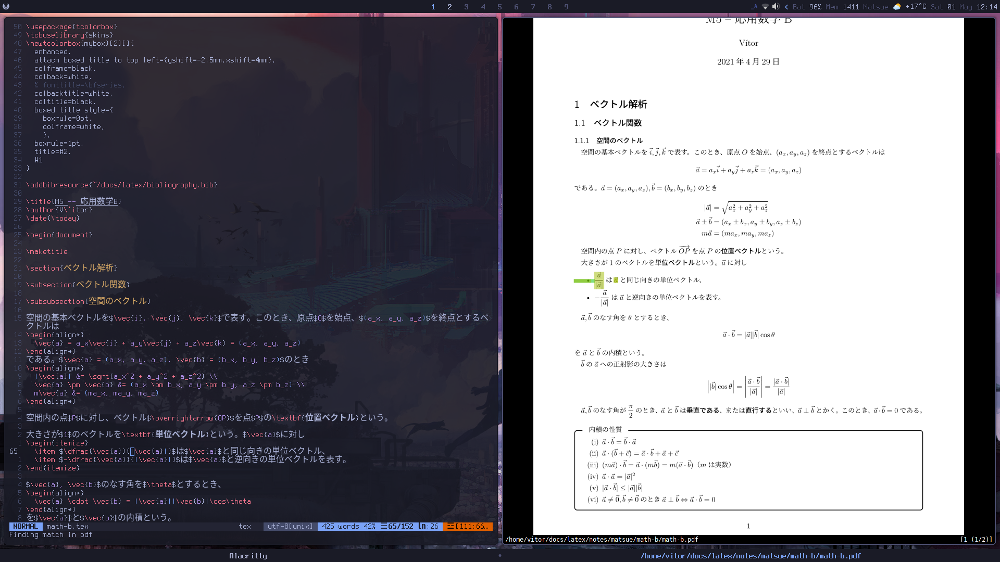

# dotfiles

My personal dumbster.

Below you can see a little bit of my LaTeX workflow, which is neovim+zathura+TinyTeX with forward/backward-search implemented.

# Note on Awesome Window Manager Config

Most of the config was done by the [Archlabs](https://archlabslinux.com/) guys, definitely check out their work.

# Installation

Pls dont
